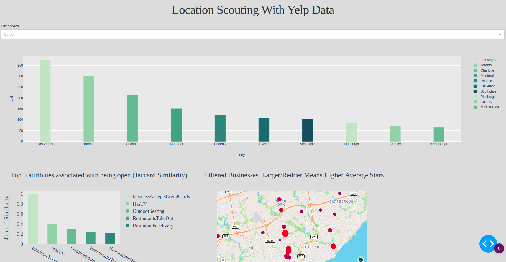

[](https://GitHub.com/Naereen/ama)
[](https://www.python.org/)

# A dashboard for scouting business locale features with the yelp dataset.
This dashboard is an extension of a project to analyze the open source yelp dataset. It is the end-result of an end-to-end analysis of the dataset proceeding through: unstructured JSON files; moving to deploying and remotely hosting a structured MySQL database on AWS; pursuing ML projects with the data and building a 90% accurate sentiment analysis tool; developing this dashboard for communication with Plotly Dash; containerizing the dashboard; deploying the dashboard to AWS Elastic Beanstalk. Deployed web app is here:

http://yelp-dashboard.eba-jpaf3bhg.us-east-2.elasticbeanstalk.com/

# Motivation
To demonstrate the abililty to self-start and develop new technology skills to prospective employers.

# Framework
Full framework requirements are located in the requirements.txt file.

# Figures


# Code Sample
```
app.callback(
    Output('intermediate-value', 'children'),
    Input('dropdown', 'value'))
def clean_data(value):
    # some expensive clean data step
    df_tag_totals = utils.top_ten_tag(value, engine)

    # more generally, this line would be
    # json.dumps(cleaned_df)
    return df_tag_totals.to_json(date_format='iso', orient='split')

# Updates a graph displaying the ten cities with the highest count of a given tag.
@app.callback(Output('topten-graph', 'figure'), Input('intermediate-value', 'children'))
def update_graph(jsonified_cleaned_data):

    dff = pd.read_json(jsonified_cleaned_data, orient='split')

    figure = px.bar(dff[0:10], x="city", y="cnt", color="city",color_discrete_sequence=px.colors.sequential.Blugrn, barmode="relative")
    figure.update_layout(bargap=0.75)
    figure.layout.paper_bgcolor = "#DCDCDC"
    figure.layout.plot_bgcolor = '#E9E9E9'
    return figure
```